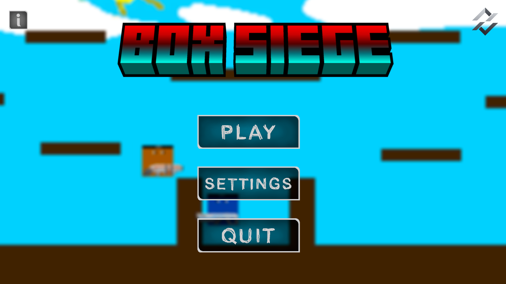
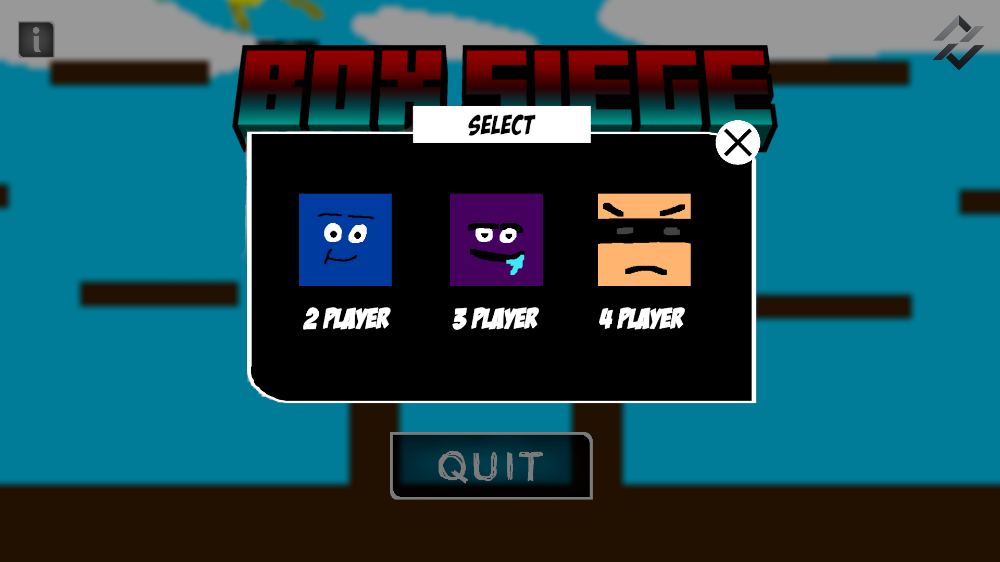
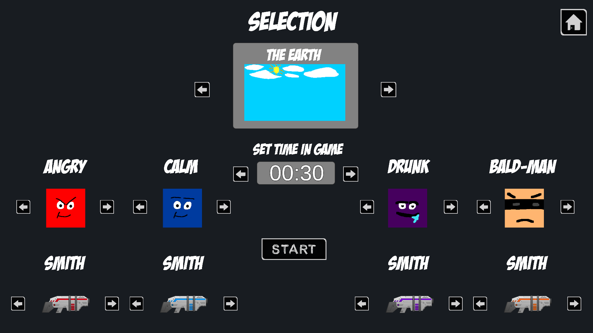
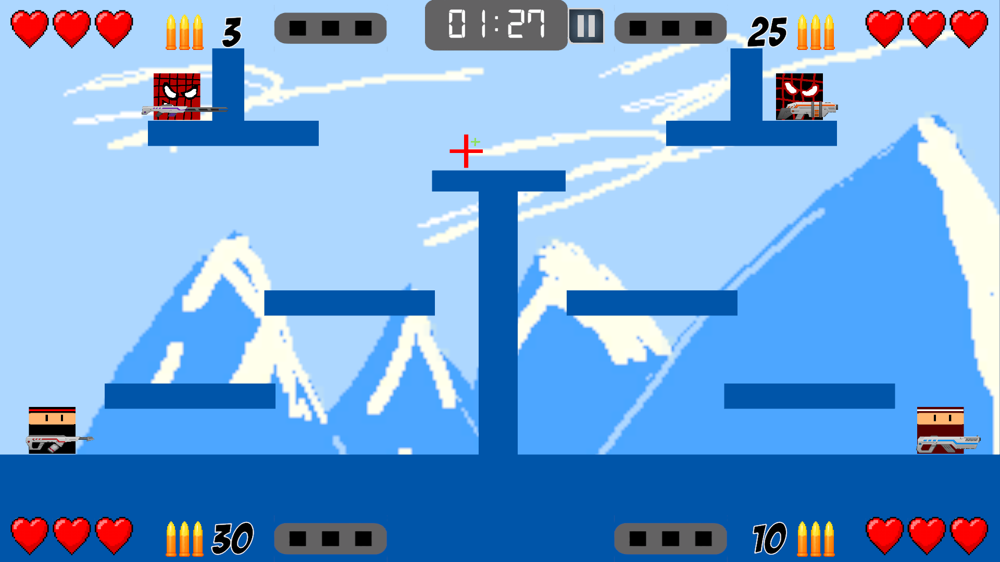
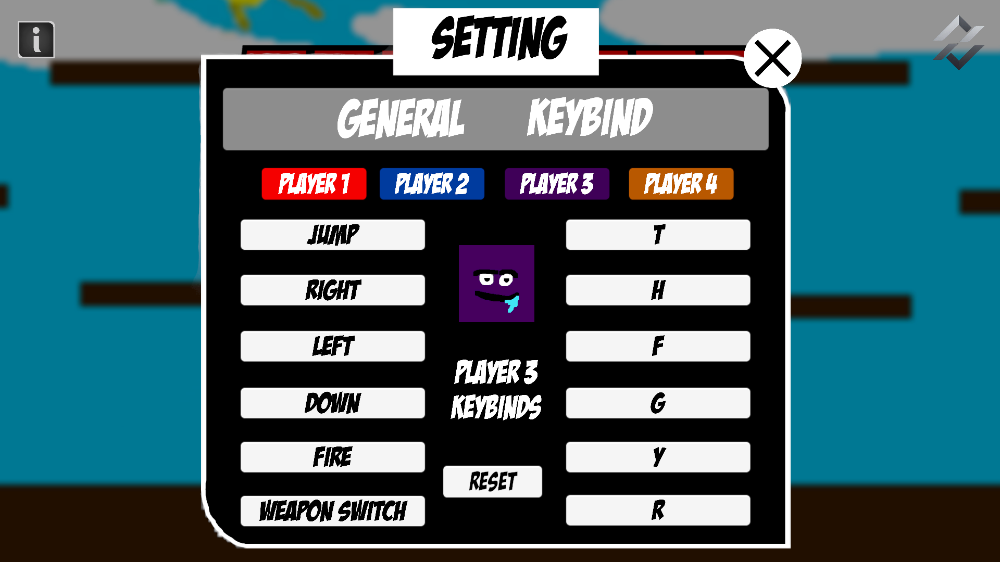
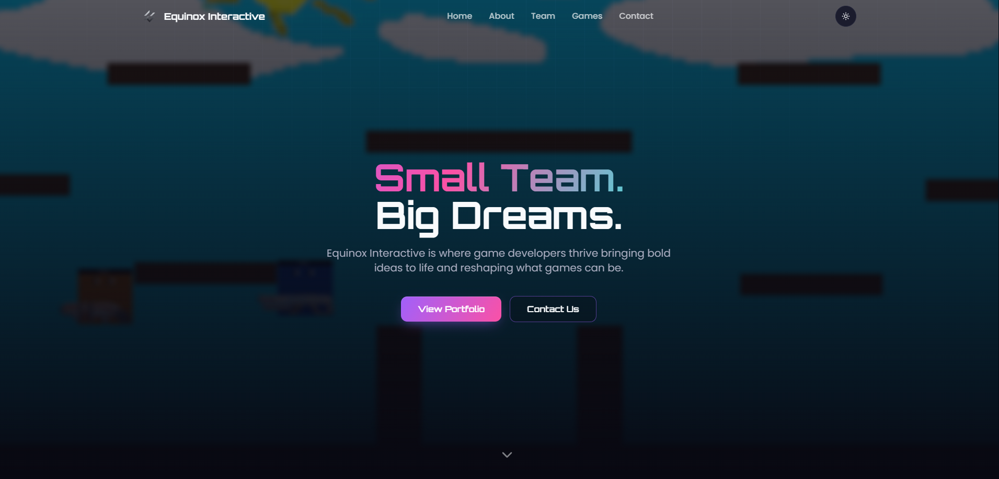
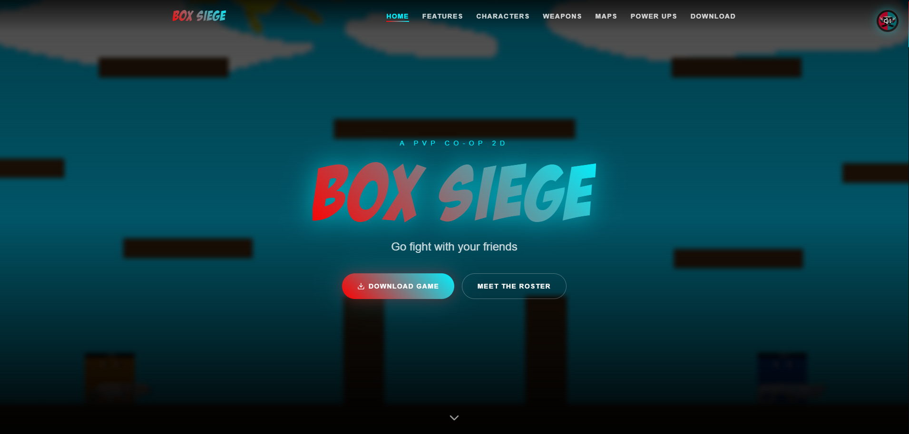
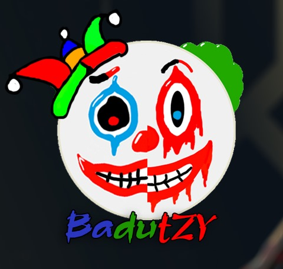
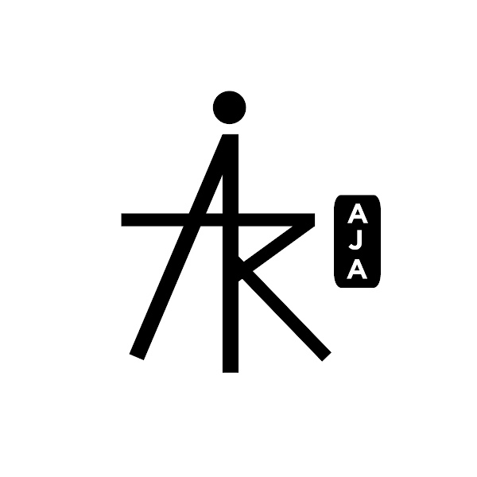
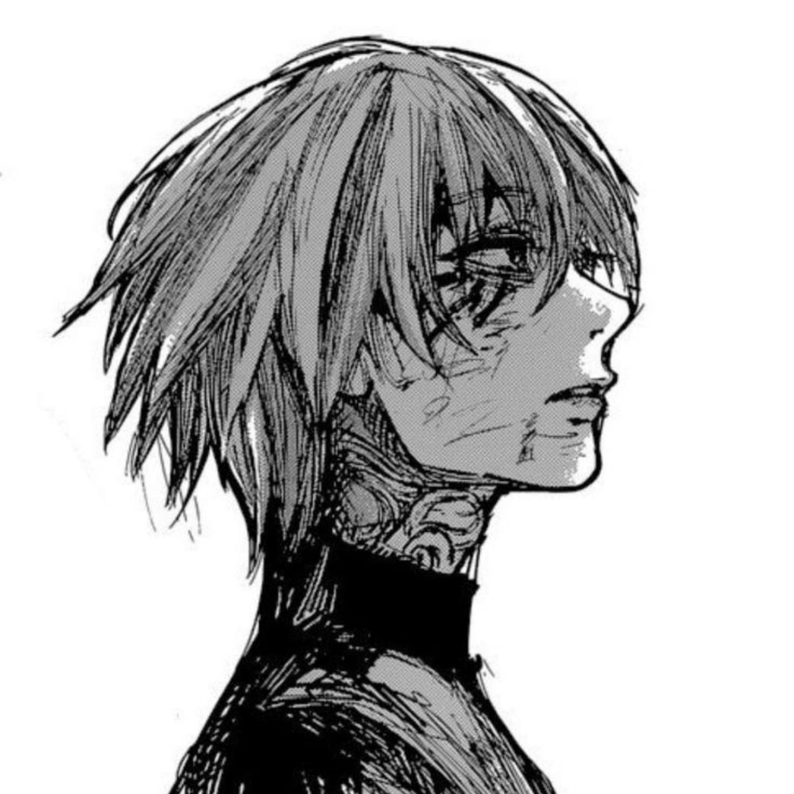

# About Us:
We are a team consisting of 3 developers to make games. We actually made this game because we got an assignment from our teacher to make a game for one month, after one month of work we finally succeeded in making a game called Box Siege, a simple game made with Unity and C#, this game can be downloaded via our website. you can try it now

<div align="center">

---

# Box Siege

**A Round-Based Local Multiplayer 2D Fighting Game**

[](https://unity.com)
[](https://learn.microsoft.com/en-us/dotnet/csharp/)
[](https://boxsiege.vercel.app)
[](https://boxsiege.vercel.app/#characters)
[](https://boxsiege.vercel.app)
[](https://boxsiege.vercel.app/#download)

[Website](https://equinoxinteractive.vercel.app) • [Download Game](https://boxsiege.vercel.app/#download) • [Our Team](#our-team)

---

## About Box Siege

**Box Siege** is a local multiplayer 2D fighting game built with Unity and C#, developed in one month as a school assignment by a team of three. Players compete head-to-head across multiple maps, choosing from a roster of 16 characters and fighting through a structured round system — complete with power-ups, rebindable controls, and a Sudden Death tiebreaker when rounds are too close to call.

### What's Inside

- **16 Playable Characters** — Each with a unique alive and death sprite, assigned per player slot
- **Round-Based Win System** — First to 3 round wins takes the match, scaled by player count
- **Sudden Death Mode** — Triggered automatically when players are tied at the final threshold
- **4 Power-Up Types** — Collectible mid-match items that shift the momentum
- **Fully Rebindable Controls** — Keyboard and gamepad support via Unity Input System
- **Graphics Settings** — Resolution and fullscreen toggle with persistent PlayerPrefs storage
- **Map Selection** — Browse and preview maps before launching into a match

---

## Quick Download

Head to the game website to download and play:

```
https://boxsiege.vercel.app/#download
```

No installation required — download, extract, and run.

---

## Game Info

| Property | Details |
|---|---|
| Genre | 2D Local Multiplayer Fighting |
| Engine | Unity |
| Language | C# |
| Players | 2 – 4 (same machine) |
| Platform | Windows |
| Development Time | 1 month |
| Team Size | 3 developers |
| Characters | 16 playable characters |
| Input | Keyboard & Gamepad (fully rebindable) |

---

## Round System

```
┌─────────────────────────────────────────────────────────────────┐
│                     BOX SIEGE — ROUND RULES                     │
├──────────────────────┬──────────────────────────────────────────┤
│  Win Condition       │  First player to win 3 rounds            │
│  2 Players           │  Max 5 rounds                            │
│  3 Players           │  Max 7 rounds                            │
│  4 Players           │  Max 9 rounds                            │
├──────────────────────┴──────────────────────────────────────────┤
│                      SUDDEN DEATH TRIGGER                       │
│                                                                 │
│  Activates when the timer expires and 2 or more players are     │
│  tied at exactly 2 wins with the same HP value.                 │
│                                                                 │
│  Rules during Sudden Death:                                     │
│    • Only tied players participate (knife combat only)          │
│    • Eliminated players: frozen, HP set to 0                    │
│    • Tied players HP reset to 3                                 │
│    • Power-ups do not spawn                                     │
│    • Timer is disabled (infinite)                               │
│    • Winner of Sudden Death = winner of the game                │
└─────────────────────────────────────────────────────────────────┘
```

---

## Power-Up System

Four power-up types spawn randomly during a match. Dead or eliminated players cannot pick them up, and they are disabled entirely during Sudden Death.

```csharp
public enum PowerUpType
{
    Health,     // Restores 1 HP to the collecting player
    Shield,     // Absorbs the next 2 hits of incoming damage
    JumpBoost,  // 1.5x jump height for 10 seconds
    SpeedBoost  // 1.5x movement speed for 10 seconds
}
```

---

## Character Roster

16 characters total, distributed across four player slots:

| Player Slot | Available Characters |
|---|---|
| Player 1 | Angry, Bandel, Melow, Ninja |
| Player 2 | Calm, Baik, Mime, Silat |
| Player 3 | Blind, Drunk, Joker, Spiderweaver |
| Player 4 | Bald-man, Deadswim, Savior, Spiderblack |

Each character has two sprites: one for alive state and one for death state, defined as a ScriptableObject:

```csharp
[CreateAssetMenu(fileName = "NewCharacterData", menuName = "Character/CharacterData")]
public class CharacterData : ScriptableObject
{
    public Sprite aliveSprite;   // Displayed while the character is alive
    public Sprite deathSprite;   // Displayed on elimination
    public string characterName; // Used in selection UI
}
```

---

## Features

| Feature | Description |
|---|---|
| Character Selection | 16 characters across 4 player slots with per-slot sprite sets |
| Map Selection | Preview and select maps before the match begins |
| Round System | Win-tracking with round box indicators per player |
| Sudden Death | Automatic tiebreaker — knife only, infinite timer, HP reset |
| Power-Ups | 4 types with mid-match random spawning via `PowerUpManager` |
| Graphics Settings | Resolution dropdown and fullscreen toggle, saved via `PlayerPrefs` |
| Rebindable Controls | Full keyboard and gamepad remapping with icon display (PS & Xbox) |
| Audio System | Per-event SFX for rounds, power-ups, and actions via `AudioManager` |
| Pause Menu | In-game pause with continue and main menu options |
| Multi-Player Scaling | UI, health, ammo, and power-up panels auto-show/hide based on active player count |

---

## Project Structure

```
BoxSiege/
├── Karakter/
│   ├── CharacterData.cs          # ScriptableObject: alive/death sprite + name
│   ├── CharacterSelection.cs     # Selection screen logic
│   ├── GameData.cs               # Singleton: carries player count across scenes
│   └── P1–P4 Sprite/             # Sprite assets per player slot
│
├── Pause Script/
│   ├── GameManger.cs             # Core: round logic, Sudden Death, win detection
│   └── PauseOption.cs            # Pause menu — continue, main menu, timescale
│
├── PowerUp/
│   ├── PowerUp.cs                # Trigger logic and effect dispatch per type
│   ├── PowerUpManager.cs         # Spawn timing and control
│   ├── PowerUpTimerUI.cs         # Active effect countdown display
│   └── PlayerPowerUpEffects.cs   # Applies shield, speed, jump effects to players
│
├── Health/                       # Health + healthbar components for P1–P4
│   ├── Health.cs / Healthbar.cs
│   ├── HealthP2.cs / HealthbarP2.cs
│   ├── HealthP3.cs / HealthbarP3.cs
│   └── HealthP4.cs / HealthbarP4.cs
│
├── Scripts/Rebinding UI/
│   ├── RebindActionUI.cs         # Input rebinding with keyboard and gamepad icons
│   ├── ControllerAssignmentManager.cs
│   └── GamepadIconsDataXbox.cs   # Xbox button icon set
│
├── Maps/
│   └── MapSelector.cs            # Browse maps, update preview, load selected scene
│
├── Resolution Setting/
│   ├── GraphicsSettings.cs       # Resolution list, fullscreen toggle, PlayerPrefs save
│   └── SettingsUI.cs
│
├── Guns/                         # Weapon and shooting scripts
├── Timer/                        # Round timer
├── Round/                        # Round UI assets and images
└── Main Menu/
    └── Main Menu.cs
```

---

## Game Preview:
  
  
  
  
  

---

### Our Website:

<a href="https://equinoxinteractive.vercel.app">
  
</a>

### Our Game Website:

<a href="https://boxsiege.vercel.app">
  
</a>

---

## Socials:
[](https://instagram.com/equinox.interactive) [](https://tiktok.com/@equinox.interactive) [](https://x.com/@EquinoxIntratve)

## Our Team:

<a href="https://badutzy.vercel.app">
  
</a>

BadutZY:

[](https://instagram.com/rzky.mp_36/)
[](https://x.com/BadutZYY_)
[](https://youtube.com/@badutzy)
[](https://github.com/BadutZY)

[](https://modrinth.com/user/BadutZY)
[](https://www.curseforge.com/members/badutzy/)

<br>

<a href="https://ariaja.pages.dev/">
  
</a>

Ari8Bit:

[](https://www.instagram.com/gamersindo_17/)
[](https://www.youtube.com/@AriAja17)
[](https://www.youtube.com/@GamersIndo17)
[](https://www.tiktok.com/@gamersindo.17)
[](https://github.com/AriAja17)

[](https://modrinth.com/user/AriAja17)
[](https://www.curseforge.com/members/ariaja17)

<br>

<a href="#">
  
</a>

SwimmingFox:

[](https://www.instagram.com/swimmingfoxx_/)
[](https://github.com/Marrwertz)

# Tech Stack:
               

<br>

*Made with dedication by Equinox Interactive — built in one month, designed to last.*

[⬆ Back to Top](#box-siege)

</div>